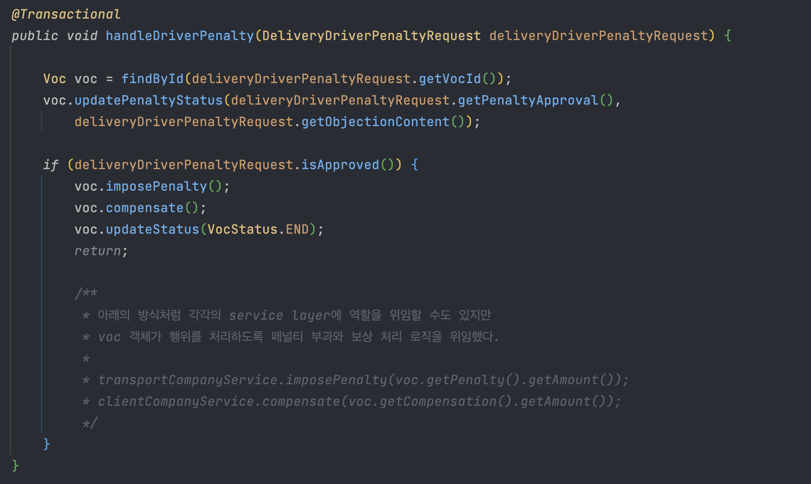
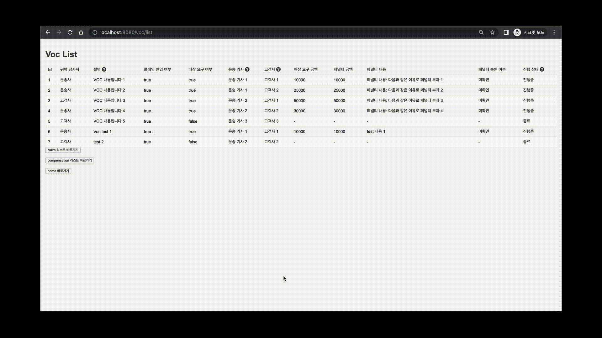
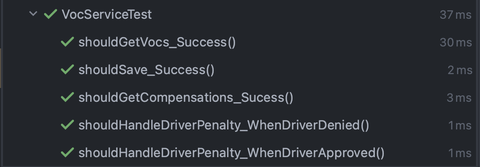

# 3PL Voc Handling Application 

### 1. 개요: 제삼자물류 시스템에서 VOC가 발생하였을 때 이를 처리하기 위한 백엔드 로직을 구현한 어플리케이션이다. 

### 2. 프로젝트 기간 : 2023.05.23 - 2023.05.29 (7일)
### 3. 개발 방법론: 
- MVP(Minimum Variable Product)로 최소한의 필요한 기능만을 구현하고자 함
- 개발 환경: `IntelliJ 2022.3`, `MacOS Monterey`
- 간단한 뷰 구성을 위해 SSR 방식 사용 (Rest 방식의 Controller 및 관련 코드는 구분을 위해 주석 처리)  

### 4. 주요 기능 : 
- 운송사, 고객사 `Entity` 생성 및 연관관계 설정  
- `Voc` 및 관련 `Value Objects`, `Entity` 생성 및 연관관계 설정  
- `Claim` 조회 기능 
- `Voc` 생성 및 조회 기능 
- `Voc` 발생에 따른 귀책 당사자 `Penalty` 처리 기능 
  - 운송사 귀책시 월금 공제
- `Voc` 발생에 따른 `Compensation` 요구 처리 기능
  - 고객사 요구시 임의의 `payment` 지급 기능
- 운송 기사 마이페이지를 통한 `Voc` 알림 기능
  - `SSE(Server-Sent Event)`를 이용한 구독->알림 로직 구현

### 3. 기술 스택 
- `Java` v11
- `Gradle` v.7.6.1
- `SpringBoot` v2.7.12
- `Spring Data Jpa` v2.7.12
- `MySql` v8.0.33
- `Testcontainers` v1.18.1
- `JUnit` v5.8.2
- `Mockito` v4.5.1
- `Docker` v20.10.22
- `Docker-Compose` v3.8
- `Thymeleaf` v3.0.15 

### 4. 설계 및 구조 
- ERD

- Class Diagram


  
### 5. 특이 사항 (java docs)

#### 1. `VocService.registerVoc()`
   
#### 2. `VocService.handleDriverPenalty()`
   
#### 3. `NotificationService`
   
#### 4. `NotificationService.emitter`
   
#### 5. `DeliverDriver.paySalary()`
   
#### 6. `VocDto.from()`
   
#### 7. `VocController.getCompensations()`
   
#### 8. `NotificationController.subscribeToNotifications()`
   
#### 9. `NotificationController.processHeartbeat()`
   
#### 10. `VocControllerTest.registerVoc_Success()` 
  


### 6. 시연 영상 및 테스트 코드 통과 현황 
- 시연 영상
  - 클레임, Voc, 배상 조회
  
  - Voc 등록
  
  - 운송기사 마이페이지
  
  - Voc 등록시 알람
  
- 테스트 코드
  
  


### 7. 구동 방법
- 필요한 환경 변수는 다음과 같다. `.env` 파일을 통해 docker 빌드시 db의 root 계정을 생성해주고 어플리케이션 구동시 주입해준다.
  - `{SPRING_DATA_SOURCE_USERNAME}`
  - `{SPRING_DATA_SOURCE_PASSWORD}`
  - `.env` 파일 예시 <br>
    `SPRING_DATASOURCE_USERNAME=root
    SPRING_DATASOURCE_PASSWORD=1234`
- docker-compose 파일을 실행해 컨테이너에 db를 띄워준다. <br>
  `docker-compose -f docker-compose-local.yml up`


  --- 

## update note

### v.1.1.0

- 카프카를 이용한 비동기 메시지 큐 구현
  - 의존성 구성 방식: `Docker-compose` 실행시 컨테이너에 `Kafka`와 `Zookeeper`를 함께 생성, `configure` 클래스에서 `bean` 등록
  - 작동 방식:
    - 새로운 `Voc`가 생성되면 `KafkaProducerService`의 `notifyNewVoc()`를 통해 등록 메시지가 `message queue`로 전달된다. `KafkaConsumerService`의 `handleNewVocNotification()` 메서드는 `new-voc` 토픽을 구독하여 새로운 `Voc` 정보를 받아본다.
    - 기존 notification alert 방식인 Sse Emitter는 유지하며, 기존 코드의 큰 수정 삭제 없이 kafka 아키텍처를 구성
  - 의의: 
    - 현재 코드에서는 단순히 업데이트에 대한 `notification` 용도로 유의미한 데이터를 전달하지는 않는다.
    - 추후 `app push` 기능을 추가할 수 있는 구성적 기반을 마련하는 데 의의가 있다. 


### v.1.2.0 
- entity 식별 토큰 추가  
  - 배경: 
    - `DBMS`의 `Entity` 개념에서 고유한 식별자는 중요한 개념이다. `Entity`의 생명주기에서 형태와 내용은 바뀔 수 있지만 연속성을 유지하기 위해서는 식별자는 유일하고 고유해야 한다.  
    - 일반적으로 `DBMS`는 `자동 증가 속성(AUTO_INCREMENT)`을 통해 PK 값을 증가시킬 수 있는 기능을 제공하며, JPA를 사용하는 프로젝트에서 `@GeneratedValue` 애노테이션을 PK 자동 생성 기능을 활용한다. 
  - 기존 방식의 문제:
    - 그러나 이렇게 생성된 pk로서의 id는 식별자라는 기능에는 충실하지만 부수적인 문제로서 보안, 비밀유지 측면에서 문제 소지 가능성을 갖는다.
    - 예를 들어, 본 프로젝트에서는 운전기사가 마이페이지에 접속할 때 `DeliveryDriver`의 `id`에 대해 `GET` 요청을 통해 `my-page`에 접근하는 시나리오를 설정했다. 
    - 이 경우 `drivery id`는 순번으로서 생성되기 때문에 임의의 숫자를 입력하여 타인의 `my-page`에 대한 접속 루트가 열리는 문제가 생긴다. 또한 경쟁사의 악의적인 시도로 특정 연속하는 순서를 요청해 당사의 운전기사 수를 유추할 수 있게 된다는 문제가 생긴다. 
    - 이처럼 `DBMS`에 고유하게 존재하는 pk 값이 인터페이스 레벨까지 올라와 버리면 내부 구조에 대한 노출로 인한 문제점을 야기할 수 있다.
    - 대체키의 사용
      - 위의 문제점을 해결하는 방법으로 대체키를 도입한 것이 해당 버전 리팩토링의 주요 사항이다. 
      - 세부 사항 
        - 기존 `GET` 요청 `URI` -> `http://localhost:54380/delivery-driver/v1/my-page?id=1`
        - 변경 `GET` 요청 `URI` -> `http://localhost:54380/delivery-driver/v2/my-page?token=ojH1C3ilyZb8Pmd`
        - 토큰은 랜덤 알파벳으로 조합된다. UUID를 사용할 수도 있었지만 알파벳 생성을 위해 `apache commons`의 `lang 라이브러리`에서 제공하는 랜덤 문자열 생성 방식을 사용하였다. 
        - 구현 코드는 다음과 같다. 
        ```java
        public class DeliveryDriver extends BaseEntity {

           private static final String DELIVERY_DRIVER_PREFIX = "deliveryDriver_";

           //...

           private String deliveryDriverToken;

           // ...

           private void generateToken() {
               this.deliveryDriverToken = TokenGenerator.randomCharacterWithPrefix(DELIVERY_DRIVER_PREFIX);
           }
        }
        
        public class TokenGenerator {
           private static final int TOKEN_LENGTH = 30;

           public static String randomCharacter(int length) {
              return RandomStringUtils.randomAlphanumeric(length);
           }

           public static String randomCharacterWithPrefix(String prefix) {
               return prefix + randomCharacter(TOKEN_LENGTH - prefix.length());
           }
        }
       - 아직 구체적인 구현은 되어 있지 않지만 외부 접촉이 가능한 엔티티들에 대해서는 이와 같은 token 속성을 모두 갖도록 하였다.  

---
